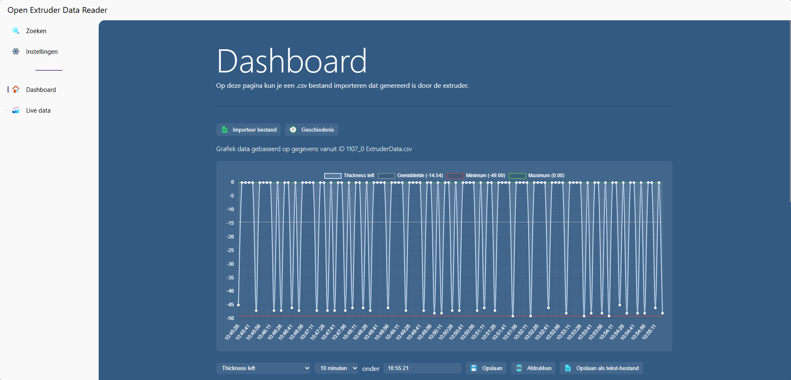

# Open Extruder Data Reader

;

Let op: dit project is een stage opdracht gemaakt door Rohan Kanhaisingh, voor het bedrijf Schmitz Foam B.V, en is bedoeld
als een educatief project. Het is niet bedoeld voor commercieel gebruik en kan fouten bevatten. Gebruik het op eigen risico.

## Over dit project

Dit project omvat een uitbebreid web-applicatie die ontworpen is om gegevens van een extruder te lezen en te visualiseren. 
Het doel van deze applicatie is om gebruikers in staat te stellen om de prestaties van hun extruder te monitoren en te analyseren door middel van een gebruiksvriendelijke interface.

## Hoe te bekijken

De web-applicatie wordt weergeven op de browser dat verbinding maakt met een lokaal beveiligd netwerk. Gebruikers kunnen met een specifeeke URL verbinding maken met de applicatie. 