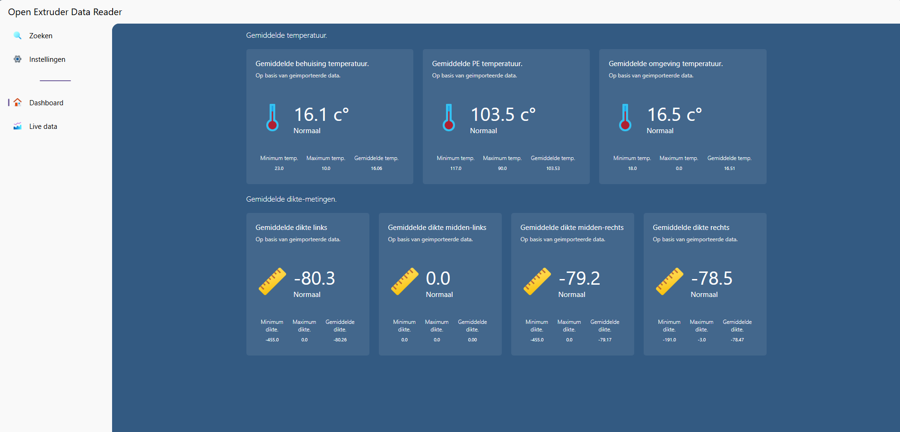

# Open Extruder Data Reader




> **Let op:** Dit project is een stageopdracht ontwikkeld door Rohan Kanhaisingh voor het bedrijf Schmitz Foam B.V. Het is bedoeld als educatief project en is niet bestemd voor commercieel gebruik. Mogelijke fouten of onvolkomenheden kunnen aanwezig zijn. Gebruik op eigen risico.

## Over het project

Open Extruder Data Reader is een uitgebreide webapplicatie ontworpen om gegevens van een extruder in te lezen en te visualiseren. De applicatie stelt gebruikers in staat om de prestaties van hun extruder op een gebruiksvriendelijke manier te monitoren en te analyseren.

## Toegang tot de applicatie

De webapplicatie wordt gehost binnen een lokaal beveiligd netwerk. Gebruikers kunnen via een specifieke URL verbinding maken met de applicatie via hun browser.

## Technologieën

Dit project is gebouwd met behulp van moderne webtechnologieën, waaronder:

- **TypeScript**
- **EJS** (Embedded JavaScript Templates)
- **SCSS (SASS)**
- **Webpack**
- **ExpressJS**
- **Stinky2D**
- **CORS**
- **CSVTOJSON**
- **DOTENV**
- **Node.js**
- **npm**

## Installatiehandleiding

### 1. Repository klonen

Clone de repository vanaf GitHub naar een lokale map:

```bash
git clone https://github.com/rohankanhaisingh/OpenExtruderDataReader-Public.git
```

### 2. Project openen en afhankelijkheden installeren

Open het project in een IDE, zoals **Visual Studio Code** of **Sublime Text**. Oorspronkelijk is dit project ontwikkeld met **Visual Studio 2022**.

Installeer vervolgens alle benodigde dependencies met:

```bash
npm install
```

### 3. Project bouwen en server starten

Compileer de broncode met Webpack:

```bash
npm run build
```

Start daarna de lokale server:

```bash
npm start
```

Activeer Webpack met een van de volgende commando’s:

```bash
npm run webpack
```

of, voor automatisch opnieuw bouwen bij wijzigingen:

```bash
npm run webpack-watch
```

### 4. Applicatie openen

Bezoek de applicatie in je browser via:

```
http://localhost:8000
```
